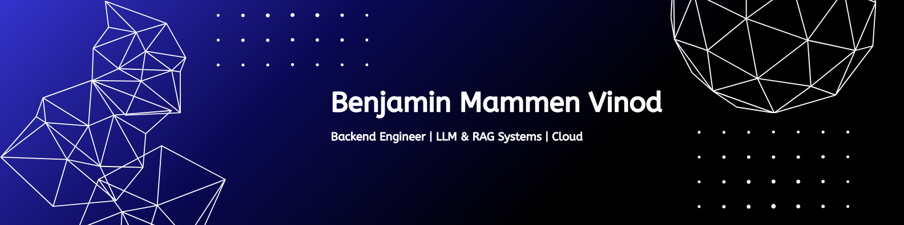

  

<h1 align="center">I'm Benjamin Mammen Vinod</h1>
<h3 align="center">Backend Engineer | LLM & RAG Systems | Cloud</h3>

  <a href="mailto:benjaminvinod99@gmail.com">📧 Email</a> •
  <a href="https://www.linkedin.com/in/benjamin-mammen-vinod-424973255/">💼 LinkedIn</a> •
  <a href="https://github.com/benjaminvinod">💻 GitHub</a>

---

## 🚀 About Me

🎓 B.Tech Computer Engineering student at MIT World Peace University (CGPA: 7.03)  
💻 Backend engineer experienced in building scalable APIs using FastAPI & Flask  
🧠 Focused on LLM-powered systems, RAG pipelines, and intelligent backend workflows  
☁️ Hands-on experience with AWS and Google Cloud  
📍 Pune, India  

I build backend systems that integrate software engineering fundamentals with AI-driven intelligence.

---

## 🛠 Tech Stack

### 💻 Languages

### ⚙️ Backend & Frameworks

### 🗄 Databases

### 🤖 AI & ML
LLMs • RAG Pipelines • Generative AI Concepts • Machine Learning Fundamentals

### ☁️ Cloud

---

## 💼 Experience

### 🧠 Generative AI Intern – Zensar Technologies (July 2025 – Present)

- Engineered a Retrieval-Augmented Generation pipeline using AWS Bedrock and ChromaDB to query a vectorized question bank of 2,500 technical questions.  
- Reduced retrieval latency to under one second through optimized embedding and vector search configuration. 
- Designed an adaptive interview engine that dynamically scales difficulty tiers (Easy, Intermediate, Hard) based on NLP-driven scoring.  
- Created a 5-tab analytics suite with skill diagnostics, automated take-home assignments, and historical performance tracking for 50 internal testers.

---

## 🚀 Featured Projects

### 🔹 Spatial Escape | Browser-Based AR Puzzle Game
- Developed a browser-based AR puzzle game using React, TypeScript, JavaScript, CSS, and real-time camera input with interactive UI overlays.
- Leveraged MediaPipe computer vision models to detect environmental cues such as shadows, bright objects, furniture, plants, and faces.  
- Implemented Three.js gyroscope-driven spatial overlays with obstacle alerts and animated navigation indicators.  
- Designed core game logic for timed riddles, scoring, hint penalties, multi-stage progression, and end-game analytics.

---

### 🔹 BenStocks | Real-Time Financial Trading Simulator
- Architected a full-stack financial simulator using Python, FastAPI, React, and MongoDB with real-time WebSocket price streaming. 
- Utilized the yfinance API and implemented a SHA-256 hashing algorithm to generate stateless, deterministic daily Mutual Fund NAVs.
- Created a Python technical analysis engine computing RSI, MACD, and Bollinger Bands alongside a tax-loss harvesting optimizer.
- Embedded a Llama 3.1 AI portfolio mentor and a custom heuristic engine for financial news sentiment analysis.   

---

## 📄 Research

### Credit Card Encryption and Decryption (April 2025)

- Analyzed AES, RSA, and ECC encryption techniques  
- Studied SSL/TLS, HTTPS, and tokenization mechanisms  
- Examined PCI DSS compliance and post-quantum cryptography considerations  

---

## 🏆 Certifications

- Microsoft – Introduction to Microsoft 365 Copilot  
- IBM – AI Workflow: Enterprise Model Deployment  
- Google Cloud Skill Badges (App Dev, Networking, ML & AI, Load Balancing, Secure Network)  
- SkillSoft – Introduction to Generative AI  

---

## 📈 GitHub Stats

---

## 🎯 Positions of Responsibility

- Head of Marketing – Google Developer Student Club  
- Head of Marketing – AWS Cloud Club  
- Events Team Member – Computer Society of India  

---

## 🌍 Languages

English • Hindi • Malayalam • Arabic  

---

⭐ Open to backend, AI systems, and product engineering opportunities.
